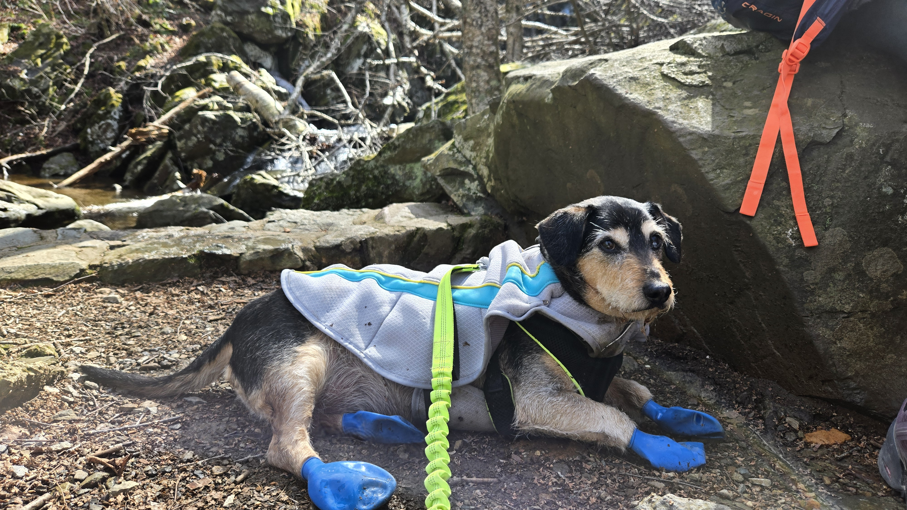

In a flash, Year 1 is done! Somehow, I was fortunate enough to land a solid team of
people in a short amount of time: Jack, Shruti, and Quin were all in lab getting 
things up-and-running right as I started, then Kaitlyn, Marisa, & Veronica joined us 
soon after. We hit the ground running with ice cream (as one should), and then 
started a long few months of getting  quotes, getting non-stop packages, 
and spending more time role-playing as engineers than working as biologists! We 
quickly got to work in the Spring as Emily joined the lab, and after a semester of
actual work with recruitment, talks, troubleshooting, interviews, rotations... we 
welcomed Lavenda into the lab as the first PhD student! 



Its pretty crazy how much things changed from one day to the next - rooms that were 
mostly empty quickly became crowded with gear, and "simple" assembly projects quickly
became a group effort of reverse engineering how to assemble things from Amazon. On
the flip side, if you ever get tired of all of the robots moving things around and the
general bustle of the lab, we do have a quiet room for folks to retreat to! And we 
finally have the capacity to hold all the cell culture samples that we're generating! 



On the teaching side of things, I helped out [Tomas Carlo-Joglar](https://science.psu.edu/bio/people/tac17) and the students 
of his Experimental Field Biology course at Penn State's brand-new field site, 
[Fuller's Overlook](https://fullersoverlook.psu.edu/), with both their research 
projects and with keep warm (and unburnt!) At the end of the academic year, we 
all went to support our first undergrad researchers, Marisa and Emily, as they
presented their work - the first research results of the lab! 



Overall, I can't overstate how proud I am of everyone this year as they helped me
build this lab from scratch - and I'm looking forward to seeing how they'll 
continue to grow, both at PSU and in their next adventures!

Now that Year 1's done, its time to look ahead - and our Chief Barketing Officer
is looking for interested grad students, postdocs, and lab techs to join us! 
Feel free to [__take a tour__]() of what our lab does, 
or [__read about our projects__](); we're especially 
excited to start studying the evolution of [__somatic mutations__]() 
and of [__genetic structural variation__]() 
across bats using long-read sequencing and pangenomics! 

If this sounds interesting to you, feel free to take a look at the links below 
and reach out!

{}
{}

{}

{}
{}

{}

{}
{}

{}

{}
{}

{}

